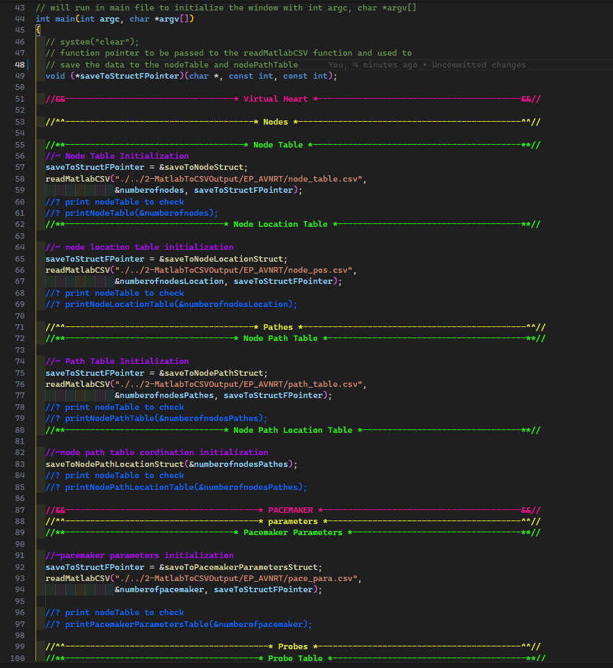

```
 __     ___      _               _   _   _                 _      ___     ____                                _
 \ \   / (_)_ __| |_ _   _  __ _| | | | | | ___  __ _ _ __| |_   ( _ )   |  _ \ __ _  ___ ___ _ __ ___   __ _| | _____ _ __
  \ \ / /| | '__| __| | | |/ _` | | | |_| |/ _ \/ _` | '__| __|  / _ \/\ | |_) / _` |/ __/ _ \ '_ ` _ \ / _` | |/ / _ \ '__|
   \ V / | | |  | |_| |_| | (_| | | |  _  |  __/ (_| | |  | |_  | (_>  < |  __/ (_| | (_|  __/ | | | | | (_| |   <  __/ |
    \_/  |_|_|   \__|\__,_|\__,_|_| |_| |_|\___|\__,_|_|   \__|  \___/\/ |_|   \__,_|\___\___|_| |_| |_|\__,_|_|\_\___|_|
```

# Virtual Heart & Pacemaker

### The project consists of two parts. The first part is converting MATLAB files to CSV files. The second part is a heart model and pacemaker that can be run with or without a user interface.

# 🖼️ Screenshots

## 1. Graphical UI 🎨

<center>
 
</center>

## 2. Terminal-based UI 📟

<center>

</center>

# 3. Code Snaps 📸

<center>

</center>

## 1. MATLAB to CSV 📊

The MATLAB to CSV converter is a MATLAB script that converts MAT files to CSV files. The MAT files contain EGM table, node position, node table, pace parameter, path table, probe position, and probe table data. The CSV files are named as egm_table.csv, node_pos.csv, node_table.csv, pace_para.csv, path_table.csv, probe_pos.csv, and probe_table.csv, respectively. The MAT files used for this project is EP_AVNRT.mat. but run perfectly with other cases like AFlutter.mat and Wenckbach.mat.
note that the CSV files are generated in the 2-MatlabToCSVOutput folder.

---

## 2. Heart & Pacemaker 🫀

The heart model consists of a heart and a pacemaker. The heart model can be run with a terminal-based UI or a graphical user interface using SDL.
The heart model reads the CSV files generated by the MATLAB to CSV converter.
note: matlabRead.c contains the universal function for reading CSV files that originated from MATLAB scripts. That address of the function that will save the data for any CSV file.

# 🚀 How to run the project

- just run the .exe files in the 3-Heart&Pacemaker(C_CODE) folder

# 🔨 How to build the project

## 1. MATLAB to CSV 📊

- Open MATLAB and run the ConvertMATtoCSVstrings.m or ConvertMATtoCSVstrings.mlx script.
- The CSV files will be generated in the 2-MatlabToCSVOutput folder.

## 2. Heart & Pacemaker 🫀

### 2.0. Settings ⚙️

- Open the Settings.h file in the 3-Heart&Pacemaker(C_CODE) folder.
- Set the UION macro to TRUE to enable the UI feature or FALSE to disable it.
- Set the SCREENSIZE macro to 0 for 1024x720, 1 for 1500x900, or 2 for 1920x1080.
- Set the DELAY macro to 0, 10, or 30 for the speed of the heart rate graph.

### 2.1. Terminal-based UI 📟

- Open the terminal and navigate to the 3-Heart&Pacemaker(C_CODE) folder.
- Run the following command to build the heart model with the terminal-based UI:
  note: this command will build the project and run the project for terminal-based UI
  ```bash
  make buildNoUI
  ```
- Run the following command to run the heart model with the terminal-based UI:
  ```bash
  make runNoUI
  ```

### 2.2. Graphical UI 🎨

link: [check for SDL UI only](#for-SDL-UI-only)

- Open the terminal and navigate to the 3-Heart&Pacemaker(C_CODE) folder.
- Run the following command to build the heart model with the graphical UI:
  note: this command will build the project and run the project
  ```bash
  make buildUI
  ```
- Run the following command to run the heart model with the graphical UI:

  ```bash
  make runUI
  ```

# 🗂️ Files tree

```
.
│   readme.md - Markdown file containing project information.
|
├───0-Assets
│       VHeart.gif
│
├───1-MatlabToCSV
│   │   ConvertMATtoCSVstrings.m - MATLAB script for converting MAT files to CSV files.
│   │   ConvertMATtoCSVstrings.mlx - MATLAB Live Script for converting MAT files to CSV files.
│   │
│   └───cases
│           AFlutter.mat - MAT file containing data for AFlutter case.
│           EP_AVNRT.mat - MAT file containing data for EP_AVNRT case.
│           Wenckbach.mat - MAT file containing data for Wenckbach case.
│
├───2-MatlabToCSVOutput
│   ├───AFlutter
│   │       egm_table.csv - CSV file containing EGM table data for AFlutter case.
│   │       node_pos.csv - CSV file containing node position data for AFlutter case.
│   │       node_table.csv - CSV file containing node table data for AFlutter case.
│   │       pace_para.csv - CSV file containing pace parameter data for AFlutter case.
│   │       path_table.csv - CSV file containing path table data for AFlutter case.
│   │       probe_pos.csv - CSV file containing probe position data for AFlutter case.
│   │       probe_table.csv - CSV file containing probe table data for AFlutter case.
│   │
│   ├───EP_AVNRT
│   │       egm_table.csv - CSV file containing EGM table data for EP_AVNRT case.
│   │       node_pos.csv - CSV file containing node position data for EP_AVNRT case.
│   │       node_table.csv - CSV file containing node table data for EP_AVNRT case.
│   │       pace_para.csv - CSV file containing pace parameter data for EP_AVNRT case.
│   │       path_table.csv - CSV file containing path table data for EP_AVNRT case.
│   │       probe_pos.csv - CSV file containing probe position data for EP_AVNRT case.
│   │       probe_table.csv - CSV file containing probe table data for EP_AVNRT case.
│   │
│   └───Wenckbach
│           egm_table.csv - CSV file containing EGM table data for Wenckbach case.
│           node_pos.csv - CSV file containing node position data for Wenckbach case.
│           node_table.csv - CSV file containing node table data for Wenckbach case.
│           pace_para.csv - CSV file containing pace parameter data for Wenckbach case.
│           path_table.csv - CSV file containing path table data for Wenckbach case.
│           probe_pos.csv - CSV file containing probe position data for Wenckbach case.
│           probe_table.csv - CSV file containing probe table data for Wenckbach case.
│
└───3-Heart&Pacemaker(C_CODE)
    │   HeartNoUI.exe - Executable file for the heart model without UI.
    │   HeartUI.exe - Executable file for the heart model with UI.
    │   main.c - Main C source file for the heart model.
    │   Makefile - Makefile for building the heart model.
    │   Settings.h - Header file containing settings for the heart model (UI on/off, Screen resolution, UI heart delay).
    │
    ├───assets
    │   ├───fonts
    │   │       Arial.ttf - TrueType font file.
    │   │       Atop-R99O3.ttf - TrueType font file.
    │   │       LoveDays-2v7Oe.ttf - TrueType font file.
    │   │
    │   └───images
    │           EP.JPG - JPEG image of the EP.
    │
    ├───HeartCSVRead
    │   │   constants.h - Header file containing constants
    │   │   dataStructure.h - Header file containing structs for data storage.
    │   │
    │   ├───matlabRead
    │   │       matlabRead.c - C source file for reading CSV files that originated from MATLAB scripts.
    │   │       MatlabRead.h - Header file for reading CSV files that originated from MATLAB scripts.
    │   │
    │   ├───nodes
    │   │       nodePath.c - C source file for node path definitions.
    │   │       nodePath.h - Header file for node path definitions.
    │   │       nodePathLoaction.h - Header file containing node path location definitions.
    │   │       nodePathLocatin.c - C source file for node path location calculations.
    │   │       nodePosition.c - C source file for node position calculations.
    │   │       nodePosition.h - Header file for node position calculations.
    │   │       nodeTable.c - C source file for node table operations.
    │   │       nodeTable.h - Header file for node table operations.
    │   │
    │   └───probe
    │           pacemakerParameters.c - C source file for pacemaker parameter calculations.
    │           pacemakerParameters.h - Header file for pacemaker parameter calculations.
    │           probePosition.c - C source file for probe position calculations.
    │           probePosition.h - Header file for probe position calculations.
    │           probeTable.c - C source file for probe table operations.
    │           probeTable.h - Header file for probe table operations.
    │
    ├───HeartModel
    │       heartModel.c - C source file for the heart model.
    │       heartModel.h - Header file for the heart model.
    │       nodeAutomaton.c - C source file for the node automaton.
    │       nodeAutomaton.h - Header file for the node automaton.
    │       pathAutomaton.c - C source file for the path automaton.
    │       pathAutomaton.h - Header file for the path automaton.
    │
    └───UI
        ├───SDL
        │       MYsdlWindow.c - C source file for the UI using SDL.
        │       MYsdlWindow.h - Header file for the UI using SDL.
        │
        └───Terminal
                TerminalUI.c - C source file for the terminal-based UI.
                TerminalUI.h - Header file for the terminal-based UI.
```

# 📜 Prerequisites

- [MATLAB](https://www.mathworks.com/products/matlab.html) - MATLAB for converting MAT files to CSV files.
- [GCC](https://gcc.gnu.org/) - GCC for compiling the C code.
- [Make](https://www.gnu.org/software/make/) - Make for building the C code.

  ## for SDL UI only:

  - [SDL2](https://www.libsdl.org/) - Simple DirectMedia Layer is a cross-platform development library designed to provide low-level access to audio, keyboard, mouse, joystick, and graphics hardware.
  - [SDL2_ttf](https://www.libsdl.org/projects/SDL_ttf/) - SDL2_ttf is a library that allows you to use TrueType fonts in your SDL applications.
  - [SDL2_image](https://www.libsdl.org/projects/SDL_image/) - SDL2_image is an image file loading library.
  - [SDL2_gfx](http://www.ferzkopp.net/wordpress/2016/01/02/sdl_gfx-sdl2_gfx/) - SDL2_gfx is a library that provides graphics drawing primitives and other support functions.

# 🙌 Acknowledgements

### Medical Cyber-Physical Systems (MedCPS) Lab at the University of Pennsylvania

<<<<<<< HEAD
-thanks to the Medical Cyber-Physical Systems Lab at UPenn for their pioneering work in the field of medical device development and validation.Their work integrates model-driven development and closed-loop validation to ensure robust and reliable medical device performance. For more information about their research and projects, visit the MedCPS Lab website: [https://mlab-upenn.github.io/medcps/index.html](https://mlab-upenn.github.io/medcps/index.html)
=======
- thanks to the Medical Cyber-Physical Systems Lab at UPenn for their pioneering work in the field of medical device development and validation.Their work integrates model-driven development and closed-loop validation to ensure robust and reliable medical device performance. For more information about their research and projects, visit the MedCPS Lab website: [https://mlab-upenn.github.io/medcps/index.html](https://mlab-upenn.github.io/medcps/index.html)
>>>>>>> efad4a26ba172637afaf77e45ad115b009f7218b

# 🙏💛 Special Thanks to Dr. Ahmed Mahmoud

- We are incredibly grateful to Dr. Ahmed Mahmoud for his invaluable guidance, support, and mentorship throughout this project. His expertise and dedication were instrumental in our success.
- [Dr. Ahmed Mahmoud's LinkedIn](https://www.linkedin.com/in/ahmedmmkms)
- [Dr. Ahmed Mahmoud's ResearchGate](https://www.researchgate.net/profile/Ahmed-Moustafa-15)
